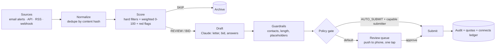

# UpBid

Continuous Upwork job detection, scoring, proposal drafting and approval-gated submission.
Runs 24/7 on a small cloud host and puts a drafted, priced, ready-to-send proposal on your phone
within seconds of a matching job being posted.



## What it does

- **Detects** new postings continuously from four pluggable sources — your Upwork job-alert
  emails over IMAP, the Upwork GraphQL API, RSS feeds, and a webhook inbox for anything else.
  Per-source checkpoints, circuit breakers, and content-hash dedupe so a re-post is not a new job.
- **Scores** each job 0–100 against your profile: hard filters first (budget floors, client spend,
  payment verification, competition, age, country), then weighted dimensions with an explainable
  breakdown, then a red-flag pass for scam and off-platform patterns. Optional Claude re-rank.
- **Drafts** a tailored cover letter, computes a bid across three pricing strategies, and answers
  the screening questions — then runs guardrails that strip contact details and reject
  over-length, placeholder-ridden or generic output.
- **Routes** it to submission through a policy gate. Default is a review queue: a Telegram push
  with Approve/Reject buttons, or the dashboard's approval screen.
- **Keeps running**: BullMQ repeatable jobs, heartbeats, health and metrics endpoints, graceful
  shutdown, quotas, a connects ledger and a full audit trail.

## About automatic submission

Upwork's GraphQL API **does** expose proposal submission — `createJobProposal`, behind a
"Submit Proposal" scope. The constraint is not technical. An API key requires $25,000 lifetime
earnings and a 90%+ JSS, is *"available for personal and internal use only"*, and the API & MCP
Terms of Use v2.3 (effective 2026-08-13) §5.9 forbid an agent from independently scoring and
ranking postings *and then taking consequential action* without your specific, contemporaneous
direction on a specific posting. Automating the **website** — extensions, RPA, session cookies in
a script — is banned outright and enforced with suspensions.

So this service automates everything up to the decision and stops there: detection, scoring and
drafting run unattended; you tap Approve. That round trip is a few seconds from your phone, and it
is the same shape Upwork's own Claude and ChatGPT integrations use. `AUTO_SUBMIT` exists for
partner arrangements that cover it, or for handing off to your own endpoint — it is off by
default and fails closed to the review queue.

**[COMPLIANCE.md](COMPLIANCE.md) has the full picture with quotes and dates**, including which
detection source is safest, the rate limits, what an Agency account changes, and which other
marketplaces permit genuinely unattended bidding. Read it before changing `SOURCES` or
`AUTO_SUBMIT`.

## Quickstart

```bash
cd upwork-autobid
cp .env.example .env          # fill in DATABASE_URL, API_KEY, ANTHROPIC_API_KEY
docker compose up -d postgres redis
npm install
npm run db:push
npm run db:seed               # creates one example monitoring profile
npm run bootstrap             # preflight: shows exactly what is and isn't configured

npm run dev:api               # dashboard + API on http://localhost:3000
npm run dev:worker            # detection, scoring, drafting, submission
```

Open `http://localhost:3000`, paste your `API_KEY` when prompted, and you are on the live feed.

## Configuration

Required:

| Variable | What it does |
|---|---|
| `DATABASE_URL` | Postgres connection string |
| `REDIS_URL` | Redis for queues, locks and quota counters (default `redis://localhost:6379`) |
| `API_KEY` | Dashboard and API auth. Required in production; also signs the one-tap approve links |
| `PUBLIC_BASE_URL` | Your deployed URL — approve/reject links are built from it |

Drafting:

| Variable | Default | What it does |
|---|---|---|
| `ANTHROPIC_API_KEY` | — | Without it, drafting falls back to templates and never stalls |
| `ANTHROPIC_MODEL` | `claude-opus-5` | Model used for drafting and optional re-ranking |
| `ANTHROPIC_MAX_TOKENS` | `2000` | Cap per draft |

Detection:

| Variable | Default | What it does |
|---|---|---|
| `SOURCES` | `upwork_api` | Comma list: `email`, `upwork_api`, `rss`, `webhook`. **See COMPLIANCE.md — `email` is the safest** |
| `IMAP_HOST` / `IMAP_PORT` / `IMAP_USER` / `IMAP_PASSWORD` | — | Mailbox receiving your Upwork instant job alerts |
| `IMAP_MAILBOX` / `IMAP_SEARCH_FROM` | `INBOX` / `no-reply@upwork.com` | Where and what to read |
| `UPWORK_CLIENT_ID` / `UPWORK_CLIENT_SECRET` | — | OAuth2 app; connect the account at `/api/oauth/upwork/start` |
| `UPWORK_TENANT_ID` | — | Sent as `X-Upwork-API-TenantId`; required for agency context |
| `RSS_FEED_URLS` | — | Comma list. Upwork discontinued its own RSS feeds in 2024 |
| `POLL_INTERVAL_SECONDS` / `FAST_POLL_INTERVAL_SECONDS` | `60` / `20` | Normal and fast-lane cadence |

Submission:

| Variable | Default | What it does |
|---|---|---|
| `AUTO_SUBMIT` | `false` | Master switch. Still requires per-profile `autoSubmit`, a score over threshold, quota headroom and a capable submitter |
| `DRY_RUN` | `true` | Records what would have been sent without sending it |
| `SUBMITTER` | `review_queue` | `review_queue`, `api`, or `webhook` |
| `SUBMIT_WEBHOOK_URL` / `SUBMIT_WEBHOOK_SECRET` | — | Hand off to your own endpoint, HMAC-signed |

Notifications — configure at least one, or you will not hear about anything off-server:

| Variable | What it does |
|---|---|
| `TELEGRAM_BOT_TOKEN` / `TELEGRAM_CHAT_ID` | Push with inline Approve/Reject buttons. The fastest path |
| `SLACK_WEBHOOK_URL` | Block Kit message with action buttons |
| `SMTP_*` / `NOTIFY_EMAIL_TO` | Email alerts and the daily digest |

## Connecting each source

**Upwork job-alert email (recommended).** Turn on instant job alerts in Upwork (requires
Freelancer Plus), point them at a mailbox, and give UpBid IMAP credentials for it. Upwork pushes
you the alert; UpBid reads your own inbox. Set `SOURCES=email`.

**Upwork API.** Apply at `upwork.com/services/api/apply` — you need $25k lifetime earnings and
90%+ JSS. Set the redirect URI to `${PUBLIC_BASE_URL}/api/oauth/upwork/callback`, put the client
ID and secret in the env, then visit `/api/oauth/upwork/start` to connect. Tokens are stored and
refreshed automatically under a Redis lock.

**Webhook inbox.** `POST /api/inbox` with your API key and a job payload. Use it for a scraper you
run elsewhere, a Zapier/Make scenario, or another marketplace entirely.

## Tuning a profile

Everything lives on the **Profile** screen. Set your keywords, required skills, budget floors and
client-quality gates, then use **Test against recent jobs** — it replays your settings over the
last 50 jobs and shows the score distribution, so you can see how many would have crossed your
threshold before anything is live. Raise `autoBidThreshold` until the green bucket is a handful a
day, not forty.

## Commands

| Command | What it does |
|---|---|
| `npm run dev:api` / `npm run dev:worker` | Local development with reload |
| `npm run build` | Prisma generate + TypeScript build to `dist/` |
| `npm start` / `npm run start:worker` / `npm run start:all` | Production API, worker, or both in one process |
| `npm run bootstrap` | Preflight and first-run setup |
| `npm test` | 50 unit tests over scoring, filters, red flags, pricing and guardrails |
| `npm run typecheck` | `tsc --noEmit` |
| `npm run db:push` / `db:seed` / `db:studio` | Schema, seed, and a database browser |

## Documentation

- **[COMPLIANCE.md](COMPLIANCE.md)** — what Upwork permits, with sources. Read first.
- **[DEPLOY.md](DEPLOY.md)** — Railway, Fly, Render and plain Docker, with the never-sleeps checklist.
- **[ARCHITECTURE.md](ARCHITECTURE.md)** — module map, data model, state machines, failure modes.
- **[OPERATIONS.md](OPERATIONS.md)** — the runbook: what to check, how to enable auto-submit safely.
